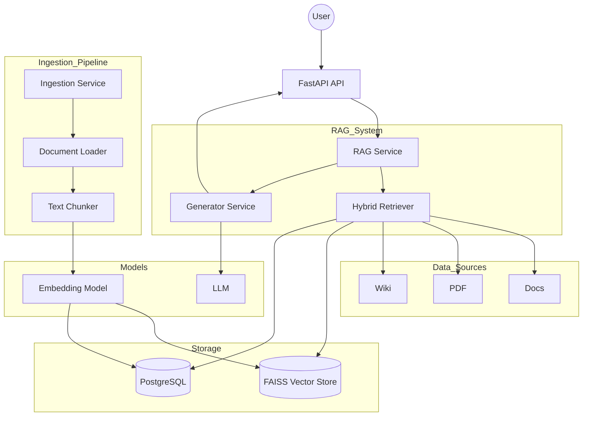

## Multi-Source RAG System

This project is an end-to-end Retrieval-Augmented Generation (RAG) system that retrieves information from multiple data sources including documents, PDFs, and Wikipedia content. The system uses semantic search with vector embeddings and Large Language Models (LLMs) to generate accurate, context-aware answers.

The pipeline includes document ingestion, text chunking, embedding generation, vector storage using FAISS, intelligent retrieval, reranking, and answer generation through LLMs. The system also supports query logging, source routing, and an interactive Streamlit interface for user interaction.


# system architecture diagram


## System Preview

### 🖥️ Streamlit UI

=======


### 🗄️ Database (PostgreSQL)


# Overview
The system follows an Multi-Source RAG pipeline:
- Ingest data from multiple sources (Docs, PDF, Wiki)
- Split into chunks
- Generate embeddings
- Store in PostgreSQL + Vector Store
- Retrieve relevant chunks using FAISS
- Generate answers using LLM
- Log queries for monitoring

# Installation

```bash
git clone https://github.com/AhmedEssamSaber/multi-source-rag.git 
cd multi-source-rag
```

# install the Requirements
```bash
pip install -r requirements.txt
```

# Usage
- Run Ingestion
```bash
python -m app.scripts.run_ingest
```

- Run Backend
```bash
uvicorn app.main:app --reload
```

- Run Frontend
```bash
streamlit run app/FrontEnd/streamlit_app.py
```

# 📁 Project Structure

```bash
app/
├── controllers/
│   ├── chat_controller.py        # FastAPI endpoint for handling chat requests
│
├── core/
│   ├── config.py                 # Project configuration 
│   ├── enums.py                  # Enum definitions 
│
├── data/
│   ├── docs/                     # Text documents source
│   ├── pdf/                      # PDF files source
│   └── wiki/                     # Wikipedia data source
│
├── FrontEnd/
│   └── streamlit_app.py          # Streamlit UI for interacting with the system
│
├── models/
│   ├── db/
│   │   ├── __init__.py           # DB module init
│   │   ├── base.py               # SQLAlchemy base model
│   │   └── database.py           # Database connection & session (Async)
│   │
│   ├── repositories/
│   │   ├── __init__.py
│   │   ├── base_repository.py        # Base CRUD operations
│   │   ├── document_repository.py    # Documents table operations
│   │   ├── chunk_repository.py       # Chunks table operations
│   │   ├── embedding_repository.py   # Embeddings table operations
│   │   └── query_log_repository.py   # Logs user queries & answers
│   │
│   ├── loader_model.py           # Load data from PDF / TXT
│   ├── chunking_model.py         # Split text into chunks
│   ├── embedding_model.py        # Generate embeddings
│   └── wiki_model.py             # Handle Wikipedia data fetching
│
├── scripts/
│   ├── download_wiki.py          # Script to download Wikipedia data
│   └── run_ingest.py             # Run full ingestion pipeline
│
├── services/
│   ├── ingestion_service.py      # Load → chunk → embed → store pipeline
│   ├── retriever_service.py      # Retrieve relevant chunks
│   ├── generator_service.py      # Generate answers using LLM
│   └── rag_service.py            # Main RAG orchestration logic
│
├──vector_store/                  
│   ├── docs.faiss
│   ├── docs_texts.pkl
│   ├── wiki.faiss
│   ├── wiki_texts.pkl
│   ├── pdf.faiss
│   └── pdf_texts.pkl
│
docker/
│   ├── docker-compose.yml        # Multi-container setup (app + DB)
│   ├── .env.example              # Example environment variables
│   └── .gitignore                # Ignore docker-related files
│
.env.example                    # Project environment variables template
.gitignore                      # Git ignore rules
LICENCE                         # Project license
requirements.txt                # Python dependencies
README.md                       # Project documentation
```

# Features
- Multi-source retrieval (docs, pdf, wiki)
- Semantic search using vector embeddings
- FAISS-based vector database
- Intelligent document retrieval and reranking
- LLM-based answer generation
- FastAPI backend API
- Streamlit frontend interface
- PostgreSQL database integration
- Modular and scalable architecture
- Docker support for deployment
- Hybrid retrieval pipeline
- Context reranking using cosine similarity
- Multi-source semantic retrieval
- Query logging and monitoring

# Database Schema
- documents
- chunks
- embeddings
- query_logs

# Database Stats
| Metric      | Count |
|-------------|-------|
| Documents   | 8     |
| Chunks      | 788   |
| Embeddings  | 788   |

# Why This Project Matters

- This project demonstrates:

  - Real-world RAG system design
  - Scalable backend architecture
  - AI + Backend integration
  - Production-level pipeline thinking

## 👤 Author

**Ahmed Essam**
- GitHub: [@AhmedEssamSaber](https://github.com/AhmedEssamSaber)

# 📄 License

This project is licensed under the terms in the [LICENSE](<LICENCE>) file.
